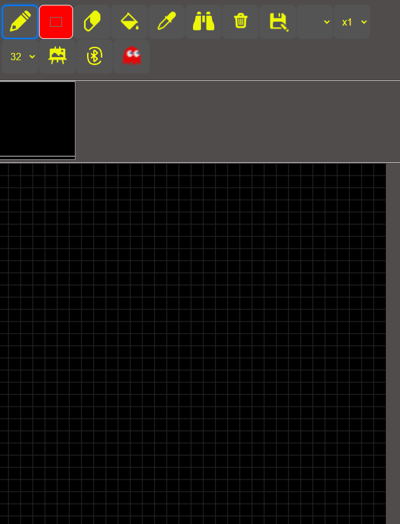
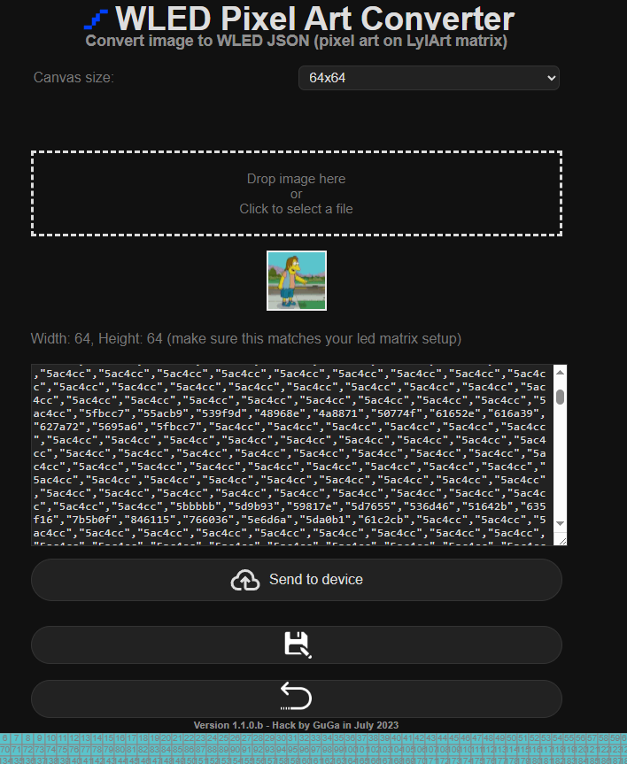
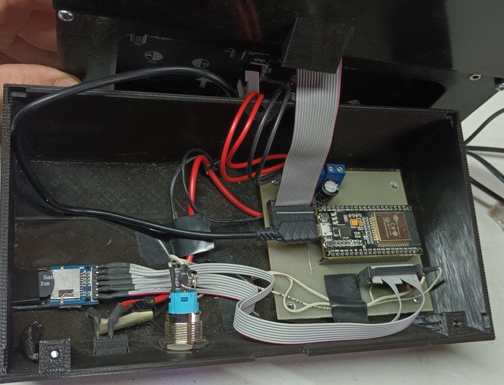
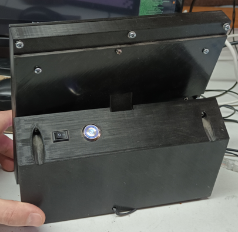
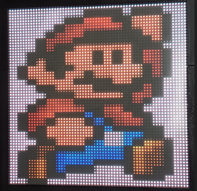
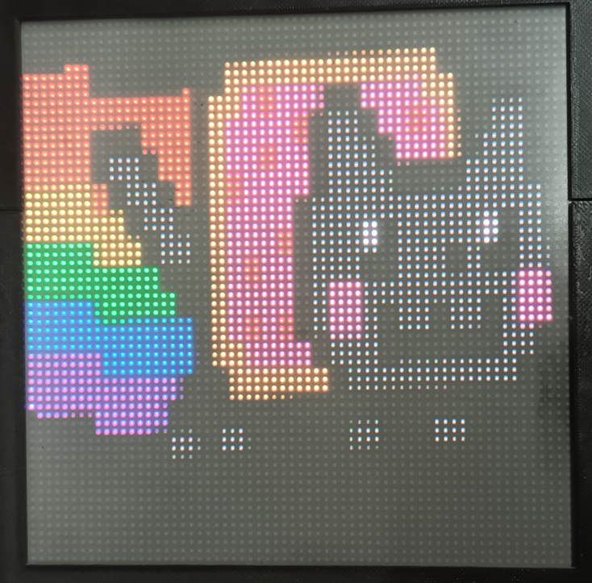
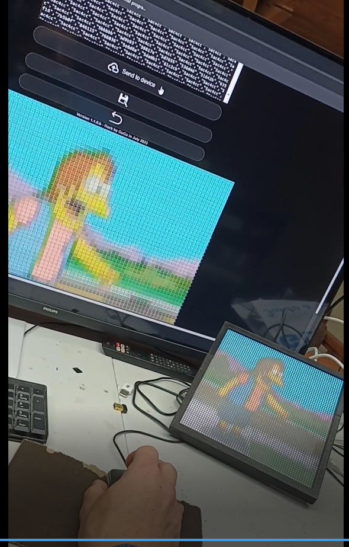

# LylaArt: pixel art digital canvas 
## HUB75 led matrix display and ESP32

ESP32 and HUB75 led matrix display for drawing pixel by pixel
- Features:
  - Dual options for operation:
    - Embedded web server with a Paintbrush-like app
    - Bluetooth Joystick controlled - MIT App inventor ANDROID apk (aia) provided 
  - uSD for writing/reading/loading images
  - Stand-alone portrait for looping saved images
  - Image converter (WLED) - For easy uploading of images

 
## Resources:
Code gathered (and modified) from here and there! Don´t judge me. Inline comments reference originals (maybe) 

Some hardware assembly 
   - Altium PCB and schematic. 
   - Electronic Schematic 
   - Printed Circuit Board PCB 
   - .stl for 3d printing - If the author pulls it - Thanks to Isaias G.

Some documents, some comments

### Some building advice
 The project is based on mrfaptastic/ESP32 HUB75 LED MATRIX PANEL DMA Display: 
 For the esp used edit the pin selection in
 .pio\libdeps\esp32dev\ESP32 HUB75 LED MATRIX PANEL DMA Display\src\platforms\esp32\
 to match your hardware. (the file Pines_utilizados.txt has my implementation)

 Use an ESP32 with Classic Bluetooth. Newer version only has BLE.
 Be careful- some pins used for the SD card are bootsptrap pins, and doesn´t let you
 upload the ESP firmware. I recommend using pin headers to easily take the ESP from the circuit,
 upload the firmware and then re-insert the chip.
 The project is served from the SD card. The required files are in data_backup and Android App folders: 
 the tree in the SD must match the following structure:

    /data - { index.html - favicon.ico - pixart1-1-0.html }
    /img - {files in txt - leave empty at start or copy the content of imgcbkup }
    /apk - {BT_Joy.apk}  -   
    
 There is a button for selecting operation mode: Web app or Bluetooth app
 pulling it up or down selects the mode of operation. If only one is required tie
 the pin PIN_INPUT_BT_CONTROL_ENABLE 3 as desired.

 A flashing led in PIN_OUTPUT_LED_OPERATION_MODE 23 can be used:
  - Solid on for Web app selection
  - Fast blinking for Bluetooth - no user connected
  - Slow blinking for Bluetooth - user connected

 The bluetooth app can be much enhance. The privided aia can be easily edited with MIT app inventor
 In the ESP side, the file BT_Joy_ctrl.cpp has the counterpart for the commands sended
 Feel free to copy, duplicate, edit, burrow, use it as is, or whatever you want
 
 ## Known bugs
    - Sometimes the SD are not correctly initialized - specially if not 
    recycling power Off and ON between SD memory extraction.
    Unplug power. Wait until the display´s turn off, and retry.
    
    - When no activity is detected between 3 minutes, the frame automatically
    display saved images. If you entablish connection after that, sometimes
    the images continues to scroll. Toggle mode button (on Web or Bluettoth App)
    until it stops. Or recycle power.

    - Flood Fill tool in large canvas (64x64) implies many web transactions.
    even though in backplane some retrys are implemented, a difference may appear between digital
    and physical canvas. Re-paint the area with discrepancies with fill tool and sync both images

    - If a new image is saved with an already existing name, it will be overwritten

    - Some Bluetooth commands fail. Retry until the physical canvas or the Android app responds    

    - When using WLED converter, if you upload an image and hit return to main page
      the digital canvas holds the image, but the web app, clears the canvas and sets
      the size to 32. If you plan to edit the uploaded file, save it, return to main page
      and load it to sync web app and physical canvas 

    - Infinite list goes here....

 ## Unknown Bugs
    - I can´t guarantee the functionality of the program when the number of files increases.
    I have already found many issues with memory managment, chunk transfers, 
    insufficient descriptors, heap leak, and etceteras. 
    SD can be extracted, and repaired with a working version of the file system. 
    I suggest you to maintain a backup of your favourite images, and a clean version of a working file system

    - Infinite list goes here....

Enjoy it!
